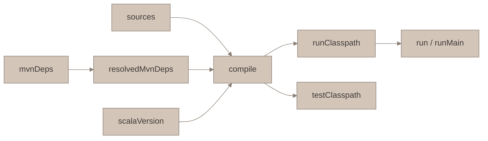

# Mill 入门教程（面向 sbt/Scala 老手）

> 用本仓库的 `interview + kyo` 双模块工程贯穿。读完你应该能独立修改 `build.mill`、加新模块、排查构建问题。

## TL;DR

- **Mill 是 task graph 工具**：`build.mill` 描述一张依赖图，`mill <path>` 是对图的 query
- **build.mill 是普通 Scala 代码**：`object foo extends ScalaModule`，享受 IDE 补全、类型检查
- **命令式表面 + 常驻 daemon 底层**：`mill` 是薄客户端，后台 server 持有热 JVM + 缓存
- **依赖写法**：`mvn"group::artifact:version"`（Scala 3 后缀 `_3` 自动拼）
- **多模块**：兄弟 `object`，每个模块 `moduleDir` 默认是 `./<名>/`

---

## 1. 心智模型：Mill vs sbt

| 维度 | sbt | Mill |
|------|-----|------|
| 接口 | shell-first（REPL） | CLI-first（每次是一条命令） |
| build 语言 | `.sbt` DSL + `.scala` plugins | 直接 Scala 脚本 (`.mill`) |
| 核心抽象 | SettingKey / TaskKey（动态作用域） | Task（静态 def 组成的图） |
| 增量缓存 | REPL 进程内保持 | 独立 daemon (`out/mill-server/`) |
| 并行 | 默认并行 task | 默认并行，图更显式 |
| 类比 | Ant/Gradle 风格命令 | Bazel/Make 风格图 |

关键差异：**Mill 把 build 当函数**。每个 `def foo = Task { ... }` 是图中一个纯节点，输入变则重算、输入不变则命中缓存。sbt 的 `TaskKey` 要靠作用域推导，Mill 是静态 def，IDE 直接跳转。

> ★ **心智锚**：如果你熟 Haskell/FP，Mill build 脚本 ≈ "构造一个 `IO[A]` 值，然后按需 run"。build 脚本是**描述**，`mill xxx` 才是**执行**。

---

## 2. build.mill 骨架

当前项目的 `build.mill`：

```scala
import mill._
import mill.scalalib._

trait Common extends ScalaModule {
  def scalaVersion = "3.8.3"
}

object interview extends Common

object kyo extends Common {
  val kyoVersion = "0.19.0"
  override def mvnDeps = Seq(
    mvn"io.getkyo::kyo-core:$kyoVersion",
    mvn"io.getkyo::kyo-direct:$kyoVersion"
  )
}
```

要点：
- `trait Common` — 共享配置，避免重复（"mixin 组合"）
- `object interview extends Common` — 声明一个模块，名字 `interview` 决定 `moduleDir = ./interview/`
- `def scalaVersion` — 这是一个 **Task**（零参 def），Mill 自动纳入图
- `mvnDeps` — 返回 `Seq[Dep]`，Mill 用 Coursier 解析

### 约定的目录布局

```
project-root/
  build.mill
  <moduleName>/
    src/main/scala/       ← main sources
    src/test/scala/       ← test sources
    resources/            ← classpath resources
  out/                    ← Mill 产物根目录（应加入 .gitignore）
```

每个模块的 `moduleDir` **默认**就是 `./<moduleName>/`，所以约定目录下不用 override `sources`。

---

## 3. Task graph 是核心抽象

### 三种 def 的区别

```scala
object foo extends ScalaModule {
  def scalaVersion = "3.8.3"          // Task（零参 def 返回普通值）
  def mvnDeps = Seq(mvn"...")         // Task（返回 Seq）
  def sources = Task.Sources(         // Task[Seq[PathRef]]
    moduleDir / "src" / "main" / "scala"
  )
  def myCustom = Task {               // 显式 Task，可包任意逻辑
    val src = sources().map(_.path)   // 用 `.apply()` 取上游 task 的值
    os.proc("wc", "-l", src).call().out.text
  }
}
```

**规则**：
- Task 之间调用用 `upstream()`（带括号），这是 Mill 的依赖声明魔法
- Task 结果**自动缓存**在 `out/<module>/<task>.json`，输入 hash 不变就复用
- 副作用（读文件、调进程）放在 `Task {...}` 内而不是 def 外部，才会被 Mill 追踪

### 查看 task 图

```bash
mill inspect kyo.compile          # 显示上下游
mill show kyo.mvnDeps             # 直接打印值（JSON）
mill visualize kyo.__             # 生成 .dot 文件可视化（需要 graphviz）
```



改一个源文件：`sources` hash 变 → `compile` 失效重跑 → `run` 失效；`mvnDeps` 没变则 `resolvedMvnDeps` 缓存命中，省去 Coursier 解析。

> ★ **关键洞察**：Mill 的缓存不是"时间戳比较"，是**内容哈希 + 依赖图**。所以 checkout 到旧分支再切回来，不会盲目全量重编——这点比 sbt 增量可靠。

---

## 4. 常用命令速查

### 选择器语法

```bash
mill kyo.compile                  # 单 task
mill kyo.{compile,test}           # 多 task
mill __.compile                   # 所有模块的 compile（__ 通配）
mill kyo._.compile                # kyo 及其所有子模块
mill "kyo.test[HelloKyoTests]"    # 参数化 task
```

### 日常工作

| 命令 | 作用 |
|------|------|
| `mill __.compile` | 全量编译 |
| `mill kyo.compile` | 只编 kyo |
| `mill -w kyo.compile` | watch 模式：改文件就重编 |
| `mill kyo.run` | 跑 main（自动识别 main class，多个会报错） |
| `mill kyo.runMain demo.HelloKyo` | 指定 main class 跑 |
| `mill kyo.test` | 跑所有测试 |
| `mill kyo.test.testOnly demo.HelloSpec` | 单个测试 |
| `mill kyo.console` | 带 classpath 的 Scala REPL |
| `mill kyo.repl` | 同上（1.x 别名） |
| `mill clean kyo.compile` | 清该 task 缓存 |
| `mill show kyo.resolvedMvnDeps` | 打印解析后的依赖 |
| `mill inspect kyo.compile` | 看 task 元数据 |
| `mill shutdown` | 关闭后台 daemon |

### 交互优化

```bash
mill -i                           # 进交互 shell，连续跑命令不重启 daemon
mill --no-server                  # 不用 daemon（调试用，慢）
mill --jobs 1                     # 强制串行（默认并行）
```

---

## 5. 依赖管理

### 语法

```scala
mvn"group:artifact:version"       // Java 依赖
mvn"group::artifact:version"      // Scala 依赖（自动拼 _3 或 _2.13）
mvn"group:::artifact:version"     // cross-full 版本（少见，跨 3.3.0 / 3.3.1 这种）
```

### 常用分类

```scala
override def mvnDeps = Seq(
  mvn"io.getkyo::kyo-core:0.19.0",        // 编译 + 运行
)

override def runMvnDeps = Seq(
  mvn"org.slf4j:slf4j-simple:2.0.16",     // 只运行时
)

override def compileMvnDeps = Seq(
  mvn"com.github.plokhotnyuk.jsoniter-scala::jsoniter-scala-macros:2.30.0", // 只编译期（宏）
)
```

### 管理版本

建议像本项目那样提到一个 `val kyoVersion = "..."`，同一生态多 artifact 用一个变量。更大项目用 BOM：

```scala
override def bomMvnDeps = Seq(mvn"io.getkyo::kyo-bom:0.19.0")
```

### 查看有效 classpath

```bash
mill show kyo.resolvedMvnDeps     # 解析后的依赖树（含传递依赖）
mill show kyo.runClasspath        # 运行时完整 classpath
```

---

## 6. 多模块实战

本项目已经有两个兄弟模块：

```scala
object interview extends Common                 // 纯 Scala，无额外依赖
object kyo extends Common {                     // 依赖 Kyo
  override def mvnDeps = Seq(mvn"io.getkyo::kyo-core:0.19.0")
}
```

### 让一个模块依赖另一个

假设以后把 `TreeNode` 抽到 interview 里想给 kyo 用：

```scala
object kyo extends Common {
  override def moduleDeps = Seq(interview)      // kyo 可以 import interview 里的类
  override def mvnDeps = Seq(...)
}
```

`moduleDeps` 表达**编译期依赖**，Mill 会把 `interview.compile` 的 classes 加到 `kyo.compileClasspath`。

### 嵌套子模块

```scala
object kyo extends Common {
  override def mvnDeps = Seq(...)

  object streaming extends Common {             // kyo.streaming
    override def moduleDeps = Seq(kyo)
    override def mvnDeps = Seq(mvn"io.getkyo::kyo-stream:0.19.0")
  }
}
```

选择器：`mill kyo.streaming.compile`。`moduleDir` = `./kyo/streaming/`。

### 模块间共享 scalacOptions、resolvers

```scala
trait Common extends ScalaModule {
  def scalaVersion = "3.8.3"
  override def scalacOptions = Seq(
    "-Wunused:all",
    "-Wvalue-discard",
    "-Xfatal-warnings",
    "-deprecation",
    "-feature"
  )
  override def repositories = super.repositories() ++ Seq(
    coursier.maven.MavenRepository("https://repo.akka.io/maven")
  )
}
```

一处改，两模块都吃。

---

## 7. 测试模块

`ScalaTests` 是 `ScalaModule` 的子 trait，约定嵌套在主模块里：

```scala
object kyo extends Common {
  override def mvnDeps = Seq(mvn"io.getkyo::kyo-core:0.19.0")

  object test extends ScalaTests with TestModule.Utest {
    override def mvnDeps = Seq(mvn"com.lihaoyi::utest:0.8.9")
  }
}
```

- `test` 自动继承父模块的 classpath（不用再写 `moduleDeps = Seq(kyo)`）
- 测试源码约定放 `./kyo/test/src/`（注意：是 `test/src/`，不是 `src/test/`——Mill 自己的布局）
- `TestModule.Utest` / `TestModule.Munit` / `TestModule.ScalaTest` 按框架选

运行：

```bash
mill kyo.test                           # 跑全部
mill kyo.test.testForked                # 新 JVM 跑，干净
mill kyo.test.testOnly demo.MySpec      # 挑一个
```

> ★ **踩坑提醒**：很多从 sbt 过来的人期待 `src/test/scala`，Mill 默认是 `test/src/`。要复用 sbt 布局就 override：
> ```scala
> object test extends ScalaTests {
>   override def sources = Task.Sources(moduleDir / os.up / "src" / "test" / "scala")
> }
> ```
> 但推荐跟 Mill 约定。

---

## 8. 实战工作流（推荐 tmux 三格）

```
┌──────────────────────────┬─────────────────┐
│ mill -w kyo.compile      │ mill kyo.console │
│ （一边改一边编）          │  （REPL 试 API）│
├──────────────────────────┤                 │
│ vim src/...              │                 │
└──────────────────────────┴─────────────────┘
```

- 左上：watch 编译，持续给错误反馈
- 左下：编辑器
- 右：`mill kyo.console` 进 REPL，`import kyo.*`，粘贴片段试手感

对 Kyo 这种 effect type 特别有用——直接在 REPL 里看 `val p: Int < IO = IO(42)` 的类型提示。

---

## 9. 常见坑

### 9.1 `moduleDir` 指向错目录

`object root extends ScalaModule` 的 `moduleDir` 是 `./root/`，**不是**项目根。本项目早期踩过这个坑：源码在 `./src/main/scala`，但 build 写 `moduleDir / "src" / "main" / "scala"` → Mill 找空目录，compile 假装成功。

**修法**：按 Mill 约定放源码到 `./<moduleName>/src/main/scala`，或显式 `moduleDir / os.up / "src" / "main" / "scala"`。

### 9.2 改 build.mill 后不生效

Mill 会自动重编 build script，但极少情况下 daemon 状态卡住：

```bash
mill shutdown
rm -rf out/mill-server out/mill-build
mill __.compile
```

### 9.3 IDE（Metals/IntelliJ）不识别新模块

```bash
mill mill.bsp.BSP/install       # 重新生成 BSP connection file
```

然后 IDE 里 "Reload Workspace"。

### 9.4 依赖冲突

```bash
mill show kyo.resolvedMvnDeps | grep slf4j
```

看传递依赖。要 override：

```scala
override def mvnDeps = Seq(
  mvn"io.getkyo::kyo-core:0.19.0".exclude("org.slf4j" -> "slf4j-api"),
  mvn"org.slf4j:slf4j-api:2.0.16"
)
```

### 9.5 包名被 Kyo 宏拦截（本项目特有）

Kyo 的 `Frame` 宏拒绝在 `kyo*` 前缀包里派生。所以 demo 包名得是 `demo` 不能是 `kyo_demo` / `kyodemo`。

---

## 10. 速查附录

### sbt → Mill 映射

| sbt | Mill |
|-----|------|
| `compile` | `mill __.compile` |
| `run` | `mill <mod>.run` |
| `test` | `mill <mod>.test` |
| `testOnly X` | `mill <mod>.test.testOnly X` |
| `~compile` | `mill -w <mod>.compile` |
| `console` | `mill <mod>.console` |
| `libraryDependencies += "g" %% "a" % "v"` | `mvnDeps = Seq(mvn"g::a:v")` |
| `scalacOptions += "-X"` | `override def scalacOptions = super.scalacOptions() :+ "-X"` |
| `lazy val foo = project.dependsOn(bar)` | `object foo extends Common { def moduleDeps = Seq(bar) }` |
| `reload` | 自动；或 `mill shutdown` |
| `show` | `mill show <task>` |

### 目录索引

```
out/
  mill-server/              daemon 状态
  mill-build/               build.mill 编译产物
  <module>/
    compile.dest/classes/   编译产物
    compile.json            task 缓存 metadata
    sources.json
    resolvedMvnDeps.json
    runMain.dest/           run 产物
```

删缓存：`mill clean <task>` 或直接 `rm -rf out/<module>/<task>*`。

---

## 最后一点建议

Mill 的哲学是 **build 也是代码**——它 dogfood Scala。所以不要把 `build.mill` 当"配置文件"去写，当成一个小型项目：抽 trait、抽常量、让类型系统帮你挡错。

读源码也实用：Mill 1.x 的 `ScalaModule` 实现在 `com.lihaoyi:mill-scalalib`，JAR 是可以在 IDE 里 decompile 看的。搞不清楚 `compile` 到底做了什么，点进去看。
